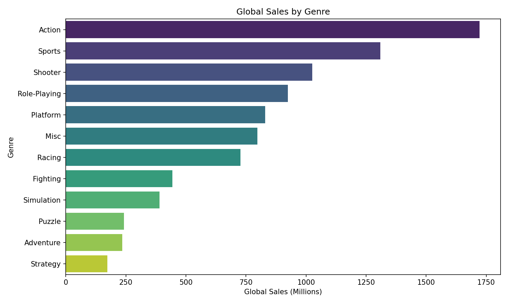
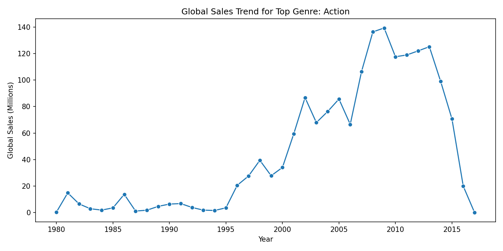
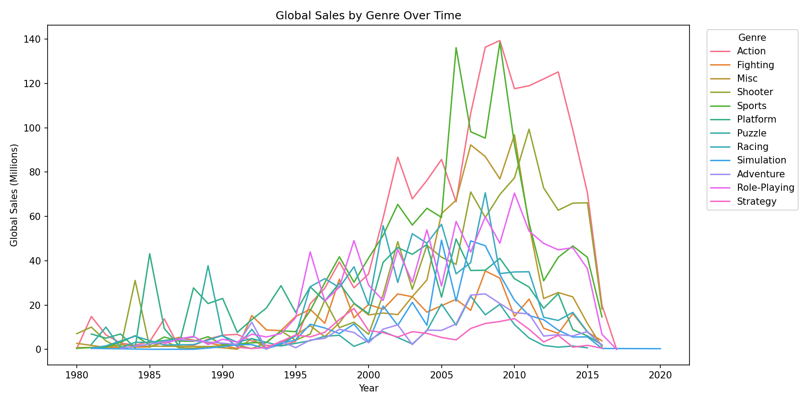

# 🎮 Analisis de ventas de videojuegos para estudio de mercado

Este proyecto realiza un flujo ETL para analizar ventas historicas de videojuegos y proponer el genero con mayor impacto para una empresa (Roadsteam). Se procesa el dataset de Kaggle de ventas globales y se generan graficas para comparar generos y observar su evolucion en el tiempo.

📌 Fuente de datos: https://www.kaggle.com/datasets/gregorut/videogamesales

---

## 🎯 Objetivo

- 🧲 Extraer el dataset desde la carpeta Extract.
- 🧽 Limpiar y transformar los datos.
- 🗄️ Cargar los datos limpios a SQLite usando SQLAlchemy.
- 📊 Generar graficas para comparar el impacto de los generos y su evolucion temporal.

---

## 🧭 Estructura del proyecto

- Extract/: lectura del CSV.
- transform/: limpieza y transformacion.
- Load/: carga a SQLite.
- config/: conexion a la base de datos.
- reports/: salida de graficas.
- data/: base SQLite local.

---

## ⚙️ Configuracion

Se utiliza un archivo .env para definir la ruta de la base de datos local:

```
DB_PATH=./data/vgsales.sqlite
```

---

## 🧪 Instalacion

```
pip install -r requirements.txt
```

---

## 🚀 Ejecucion

```
python Main.py
```

---

## 🧾 Salidas

- 🗃️ Base SQLite: data/vgsales.sqlite
- 📈 Graficas:
  - reports/genre_sales_comparison.png
  - reports/top_genre_trend.png
  - reports/genre_trends_over_time.png

---

## 🖼️ Vista rapida de graficas





---

## 🧠 Funciones principales (extracto de codigo)

### 📥 Extraccion

```python
def extract_vgsales(csv_path=None):
	"""Lee el CSV desde Extract/vgsales.csv y retorna un DataFrame."""
```

### 🧼 Transformacion

```python
def clean_vgsales(df):
	"""Limpia columnas, tipos y filtra anios validos."""
```

### 🗄️ Carga

```python
def load_to_sqlite(df, engine, table_name="vgsales"):
	"""Guarda el DataFrame en SQLite con SQLAlchemy."""
```

### 📊 Graficas

```python
def plot_genre_sales(df, output_dir):
	"""Grafica ventas globales por genero."""

def plot_top_genre_trend(df, output_dir):
	"""Grafica la evolucion del genero con mayor impacto."""

def plot_all_genres_trend(df, output_dir):
	"""Grafica la evolucion de todos los generos a traves del tiempo."""
```

---

## 🔁 Flujo general

1. Extract: lectura del CSV.
2. Transform: limpieza de datos.
3. Load: carga en SQLite.
4. Reporting: generacion de graficas.